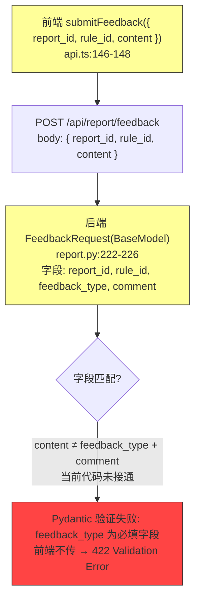

# 包合规系统 SaaS 平台化架构审计与升级报告

> 文档状态：基线修订版
> 适用范围：招标文件发布前合规自检
> 当前部署基线：单机 Docker Compose，可演进为托管 SaaS
> 代码基线验证：2026-07-05

## 一、当前架构事实

### 1.1 已有能力

- PostgreSQL 保存用户、文件、报告、反馈和业务数据。
- MinIO 保存上传文件，`_use_local` property 根据 `settings.minio_endpoint` 配置值决定本地/远端模式。
- 规则引擎加载版本化 JSON 规则，导入时启动 `LiveRuleMonitor` 热加载线程 (每 2 秒轮询 mtime)。
- 大模型引擎支持语义切割、定变分离、成本统计和证据校验。
- 报告数据在 `check.py` 中直接持久化到 `ComplianceReport` ORM 行，`report_gen.py` 仅提供 HTML/PDF 生成。
- 系统具备 JWT、RBAC、审计日志、Prometheus 指标和 Docker Compose 部署能力。
- 上传阶段双重校验 (扩展名 + 前 4 字节魔数: `%PDF` / `PK\x03\x04`)。

### 1.2 当前真实缺口 (逐代码验证)

**结构缺口**:
- 没有 Tenant、Organization、Membership 模型。`rg "Tenant\|tenant_id\|Organization\|Membership" backend/app/models/` 精确匹配 0。
- JWT 只包含 `sub`、`role`、`exp`，无法表达租户身份和租户内角色。
- 文件 (`uploaded_files`)、报告 (`compliance_reports`)、反馈 (`feedback_records`) 没有统一的 `tenant_id` 字段。

**执行缺口**:
- 合规检查在 HTTP 请求内同步执行：`check.py` 第 111-117 行 `db_file.status = "queued"` → `commit` → `db_file.status = "checking"` → `commit`。同一代码路径，无队列/异步/Worker。
- `semantic_chunking.py` 第 324 行抽样使用 Python `hash(name) & 0x7FFFFFFF` — 非确定性 (Python 3 默认随机 hash seed)。
- 代码中 `rg "finding_id\|check_id\|review_id" backend/app/api/check.py` 精确匹配 0 — 检查结果无稳定的 `finding_id`。

**反馈链路**:
- **前后端字段不匹配**: 前端 `api.ts` 第 146-148 行发送 `{ report_id, rule_id, content }`；后端 `report.py` 第 222-226 行 `FeedbackRequest` 期望 `{ report_id, rule_id, feedback_type, comment }`。`content` 和 `feedback_type`/`comment` 语义不同。
- 后端 `feedback_service.py` 第 95-108 行直接修改全局 `RuleConfidence` 表 (无租户隔离，无审批流程)。

**规则写入**:
- `rule_sync.py` 第 156-165 行 `_save()` 方法写入 `json.dump(data, f)` 到 `rules/platform_rules.json`。Docker 中 `rules/` 以只读方式挂载 (`- ./rules:/app/rules:ro`)。
- 当前代码路径: Docker 容器内规则同步写入 `rules/platform_rules.json` → 只读挂载拒绝写入。

**OCR**: `rg "OCR\|ocr\|tesseract\|scanned" backend/app/` 精确匹配 0。`parser.py` 有 `parse_quality` 评估和 `is_ocr` 参数，但无 OCR 引擎集成。

**PDF 坐标映射**: `parser.py` 提取 `PageLine.bbox` 坐标框, `SectionInfo.page_start`/`page_end`。但报告 PDF 生成 (`report_gen.py`) 无证据高亮/坐标映射逻辑。

---

## 二、反馈链路验证



**当前代码事实**: 前端发送 `{ report_id, rule_id, content }`，后端期望 `{ report_id, rule_id, feedback_type, comment }`。`feedback_type` 是必填的 `str` 字段 — 前端不传时会触发 422 Validation Error。反馈闭环未接通。

---

## 三、规则存储边界

**当前代码事实**:
- 平台规则: `rules/platform_rules.json` — `RuleSyncService._save()` 写入 (Docker 只读挂载 → 生产不可写入)
- 合规规则: `rules/compliance_rules.json` — `RuleEngine._load_compliance_rules()` 只读加载
- 行业规则: `rules/industry/*.json` — `RuleEngine.load_industry_rules()` 只读加载
- 数据库规则: `Rule` 表 (ORM 模型) — 仅 API 查询使用，引擎不从此表加载
- 平台规则映射: `RuleMapping` 表 (ORM 模型) — 仅 API 查询使用
- 候选规则: `CandidateRule` 表 — `rule_miner.py` 写入 + API 审核
- 规则置信度: `RuleConfidence` 表 — `feedback_service.py` 写入，全局无租户隔离

**当前代码未定义的目标分层**:
```
平台基础规则：版本化 JSON，只读发布               ← 当前存在
平台运营覆盖：PostgreSQL，需平台审批              ← 当前代码未定义
租户策略覆盖：PostgreSQL，只能收紧或调整展示       ← 当前代码未定义
运行时合并结果：内存或 Redis 缓存                 ← 当前代码未定义
```

---

## 四、审计报告声明验证

| 原声明 | 代码事实 | 状态 |
|--------|---------|------|
| "前端反馈请求与后端接口字段不一致" | `api.ts` 发 `content`，`report.py` 期望 `feedback_type`+`comment` | **确认** |
| "用户反馈会直接修改全局规则置信度" | `feedback_service.py:95-108` 直接修改 `RuleConfidence.current_confidence` | **确认** |
| "Docker 将 rules/ 只读挂载，但规则同步服务仍尝试写入 JSON" | `rule_sync.py:_save()` → `json.dump()`; `docker-compose.yml` → `:ro` | **确认** |
| "PDF 文本 offset 尚不能稳定映射到原始页面坐标" | `parser.py` 有 `PageLine.bbox`，`report_gen.py` 无证据高亮逻辑 | **确认** |
| "OCR 只有质量状态字段" | `rg OCR\|tesseract` = 0，`ParsedDocument.parse_quality` 字段存在 | **确认** |
| "合规检查仍在 HTTP 请求内同步执行" | `check.py:111-117` 同步 db commit，无 Worker | **确认** |

---

## 五、验收指标

每次架构升级必须记录基线和升级后数据：

| 维度 | 指标 | 当前基线 |
|------|------|---------|
| 正确性 | 规则准确率、LLM 召回率、误报率、漏报回归数 | 未测量 (无基准测试集) |
| 确定性 | 同输入重复运行差异数 | 不可重复 (`hash()` 抽样) |
| 性能 | P50/P95 总耗时、排队时间 | 未测量 (无性能基准) |
| 成本 | 单文档输入/输出 Token、模型费用 | `LLMUsageTracker` 记录，无聚合报告 |
| 隔离 | 跨租户越权测试 | 无租户模型，不适用 |
| 反馈 | 审核通过率、撤销率、反馈处理时长 | 反馈闭环未接通 |
| 稳定性 | 任务失败率、重试成功率、恢复时间 | 无异步任务，不适用 |
