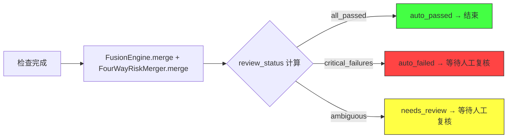

# 包合规（baohegui）数据流追踪与结构断点

> **生成日期**: 2026-07-05
> **基线范围**: 从真实代码逐行追踪，禁止推断
> **验证方式**: 6 路并行代理读取所有源文件 + 逐项验证命令

---

## 1. 上传链数据流

### 1.1 端到端上传流 (Mermaid)

```mermaid
flowchart TD
    A["前端 Upload.tsx<br/>FormData(file)"] --> B["POST /api/upload/<br/>@router.post('/')"]
    B --> C["Depends(get_current_user)<br/>JWT → user dict"]
    C --> D["check_quota(db, user_id)"]
    D -->|exhausted| D1["402 Payment Required"]
    D -->|ok| E["ext = filename.split('.')[-1].lower()"]
    E -->|ext not in allowed_extensions| E1["400 Bad Request"]
    E -->|ok| F["tempfile.mkstemp(suffix='.upload')"]
    F --> G["流式读取: 64KB/chunk"]
    G --> G1["hashlib.sha256 累加"]
    G --> G2["head_bytes 取前4字节"]
    G --> G3["os.write 到临时文件"]
    G --> G4["每256KB写 _upload_progress"]
    G3 --> H["_detect_file_type(head_bytes)"]
    H --> H1["魔数检测: %PDF → pdf, PK\x03\x04 → docx"]
    H --> I{"detected_type == ext?"}
    I -->|否| I1["400 Bad Request"]
    I -->|是| J["minio_service.upload_from_path(storage_key, tmp_path, content_type)"]
    J -->|MinIO 模式| J1["MinIO put_object"]
    J -->|本地模式 (config决定)| J2["shutil.copy2 到 storage_dir"]
    J --> K["parser.parse(tmp_path)"]
    K --> L["创建 UploadedFile 行<br/>status='uploaded'"]
    L --> M["遍历 parsed.raw_sections<br/>创建 DocumentSection 行"]
    M --> N["Path(tmp_path).unlink(missing_ok=True)<br/>清理临时文件"]
    N --> O["consume_file(db, user_id)<br/>递增 files_used"]
    O --> P["返回 {file_id, db_id, filename, page_count, sections, industry}"]
```

### 1.2 上传链关键事实

**魔数检测**: 使用 `_detect_file_type(head_bytes)` 校验前 4 字节。`\x25\x50\x44\x46` → pdf, `\x50\x4b\x03\x04` → docx (且需包含 `[Content_Types].xml`)。检测类型与扩展名不匹配 → 400。**扩展名 + 魔数双重校验**。

**配额检查**: 上传前调用 `check_quota(db, user_id)`，配额耗尽返回 402。上传成功后调用 `consume_file(db, user_id)`。**配额检查与消费不在同一事务**。

**MinIO 本地模式**: 由 `settings.minio_endpoint` 配置值决定（空字符串 或 `0.0.0.0:1` → 本地模式）。**非连接失败自动回退**。

**DocumentSection 持久化**: 上传阶段创建 `DocumentSection` 行，但检查阶段**不读取**这些行。检查阶段独立重新解析文件。

---

## 2. 检查链数据流

### 2.1 端到端检查流 (Mermaid)

```mermaid
flowchart TD
    A["POST /api/check/{file_id}<br/>?industries=&sector=&procurement_method=&project_type="] --> B["Depends(get_current_user)"]
    B --> C["_check_rate_limit(user_id)<br/>内存滑动窗口, 10次/分钟"]
    C -->|超限| C1["429 Too Many Requests"]
    C -->|ok| D["db.query(UploadedFile).filter(id==file_id)"]
    D -->|不存在| D1["404"]
    D -->|存在| E["assert_resource_access(db, db_file, user)<br/>仅本端点使用; upload status 和 check status<br/>使用内联 owner/admin 判断"]
    E -->|非所有者且非admin| E1["403"]
    E -->|ok| F["状态机检查: status in (uploaded,queued,failed,completed)?"]
    F -->|否| F1["409 Conflict"]
    F -->|是| G["db_file.status = 'queued' → db.commit()"]
    G --> H["db_file.status = 'checking' → db.commit()"]
    H --> I["minio_service.local_path(storage_path)"]
    I --> J["parser.parse(local_path)  ← 重新解析文件"]
    J -->|失败| J1["status='failed', 400"]
    J -->|成功| K["industries → rule_engine.set_active_industries()"]
    K --> L["_extract_budget_from_document(parsed)  ← 正则提取预算金额"]

    L --> M["第0层: compliance_router.route(budget, procurement_method, project_type)<br/>project_type 形参存在但方法体内不使用"]
    M --> M1["routing_result: traffic_light, llm_task_list, skip_llm, reasoning"]
    M1 --> N["variable_marker.mark(parsed_doc, sector, procurement_method, project_type)<br/>→ MarkedDocument"]

    N --> O["第1层: rule_engine.run(sections, full_text, marked_doc)"]
    O --> O1["check_sections → check_keywords → check_forbidden_words → check_format_keywords"]
    O1 --> O2["RuleEngineResult: violations + scores"]

    O2 --> P["第2层: ParameterBiasDetector().run(sections)"]
    P --> P1["9种违规模式正则匹配"]
    P1 --> P2["BiasFinding → 映射为 Violation 对象"]

    P2 --> Q["RAG上下文构建 (check.py 内联)"]
    Q --> Q1["遍历 rule_result.violations → knowledge_graph.build_rag_context(db, rule_id, desc)"]
    Q1 --> Q2["丰富 v.law_ref: 追加 KG 上下文"]
    Q2 --> Q3["构建 kg_context 字符串: 最多5条违规, 每条最多2法规+2案例"]
    Q3 -->|无规则违规匹配| Q4["回退: knowledge_graph.find_similar_cases(db, desc, limit=3)"]

    Q3 --> R{"routing_result.skip_llm?"}
    R -->|是| R1["llm_result = None, 跳过LLM"]
    R -->|否| S["第3层: llm_engine.analyze(sections, rule_violations, file_id, user_id, target_section_types, marked_doc, industry_descriptions, kg_context)"]
    S --> S1["LLMEngine 内部: semantic_chunker.chunk() → _build_section_prompt() → provider.chat() → _parse_violations() → _deduplicate_violations()"]
    S1 --> S2["LLMEngineResult: violations + tokens_used + cost_yuan"]

    S2 --> T["验证层: validate_llm_evidence(llm_result, parsed.full_text)"]
    T --> T1["evidence_matcher.best_match() 逐条验证LLM证据"]

    T1 --> U["汇总层: fusion_engine.merge(rule_result, llm_result, bias_violations, file_name, check_time)"]
    U --> U1["FusionEngine.merge → deduplicate → calculate_total_score → ComplianceReport (Pydantic)"]

    U1 --> V["four_way_merger.merge(routing_result, rule_engine_result, parameter_bias_result, llm_result, parse_quality)"]
    V --> V1["MergeResult: final_passed, review_status, requires_human_review, confirmed/high_risk/needs_review/advisory 分组"]

    V1 --> W["构建 diagnostics 字典 (13个子字典)"]
    W --> X["创建 ComplianceReport ORM 行<br/>report_data = json.dumps({...report, _diagnostics, _merge_result})"]
    X --> Y["db_file.status = 'completed' → db.commit()"]
    Y --> Z["consume_tokens(db, user_id, tokens_used, cost_yuan)"]
    Z --> AA["返回扁平大对象 (所有分数/计数/分组/诊断)"]
```



### 2.2 检查链关键事实

**重新解析文件**: 检查阶段通过 `minio_service.local_path` 下载文件 → `parser.parse(local_path)` 重新解析。**不读取上传阶段写入的 DocumentSection 行**。

**ComplianceReport 持久化位置**: 在 `check.py` 中直接创建 `ComplianceReport` ORM 行并 `db.commit()`。`report_gen.py` 的 `ReportGenerator` **不负责持久化**。`report_gen.py` 仅提供 `generate_html()` 和 `generate_pdf()` 用于导出。

**PDF/Excel 生成时机**: 在 `/api/report/{report_id}/pdf` 和 `/api/report/{report_id}/export` **按需生成**，每次下载重新构建。

**routing_result.llm_task_list**: 在 `routing.py` 中被生成（`RoutingResult` 字段），但在 `check.py` 中**未直接使用该字段**来筛选 LLM 检查维度。`check.py` 仅使用了 `routing_result.skip_llm` 来决定是否跳过 LLM；`target_section_types` 直接从 `parsed.sections.keys()` 构建，而非从 `llm_task_list` 构建。

**project_type**: 作为形参存在于 `ComplianceRouter.route()` 签名中（第 27 行），但在方法体内**从未被引用**。当前代码未接通。

**industry_load_warnings**: 在 `check.py` 第 141 行声明 `industry_load_warnings: list[str] = []`，但**从未被赋值或消费**。当前代码未接通。

**queued/checking 是同一 HTTP 请求内的状态提交**: 第 111 行 `db_file.status = "queued"` → commit → 第 117 行 `db_file.status = "checking"` → commit。两者之间无延迟、无队列、无异步。注释写"模拟入队延迟"但无实际延迟代码。

**Token 配额消费非原子**: 第 428 行 `db.commit()` (报告持久化) 与第 434 行 `consume_tokens(...)` 不在同一事务中。如果 `consume_tokens` 失败，报告已提交但配额未扣减。

---

## 3. 权限数据流

### 3.1 多路径权限模型 (Mermaid)

```mermaid
flowchart TD
    subgraph "路径1: 公开接口 (无认证)"
        A1["/api/auth/login"] --> P1["无 Depends"]
        A2["/api/auth/register"] --> P1
        A3["/api/auth/forgot-password"] --> P1
        A4["/api/auth/reset-password"] --> P1
        A5["/api/auth/send-verification"] --> P1
        A6["/api/auth/verify-email"] --> P1
        A7["/api/announcements (GET '')"] --> P1
        A8["/api/categories/*"] --> P1
    end

    subgraph "路径2: Depends(get_current_user)"
        B1["/api/upload/*"] --> Q1["get_current_user<br/>→ JWT decode → {sub, role, exp}"]
        B2["/api/check/*"] --> Q1
        B3["/api/report/*"] --> Q1
        B4["/api/member/dashboard"] --> Q1
        B5["/api/crawler (读: source-health, status, cases, case-detail, stats)"] --> Q1
        B6["/api/kg (读: search, related, regulation, cases, similar-cases, template, rag-context, stats)"] --> Q1
    end

    subgraph "路径3: Depends(require_admin)"
        C1["/api/admin/*"] --> R1["require_admin<br/>→ get_current_user → 检查 role=='admin'"]
        C2["/api/rules (写: reload, platform POST/PUT/DELETE, toggle, import, sync-run, rollback, batch/toggle)"] --> R1
        C3["/api/crawler (写: trigger, jobs, analyze)"] --> R1
        C4["/api/kg (写: seed, node audit/create/update/delete, edge)"] --> R1
        C5["/api/admin/cases (管理: review-queue, stats, detail, update, review, dedup, bulk-dedup)"] --> R1
        C6["/api/admin/candidate-rules"] --> R1
    end

    subgraph "路径4: PermissionService.require_permission"
        D1["/api/report/feedback/rules-needing-review"] --> S1["require_permission(Permission.RULES_READ)<br/>→ get_current_user → PermissionService.has_permission()"]
        D2["/api/stats/dashboard"] --> S2["require_permission(Permission.STATS_DASHBOARD)<br/>→ get_current_user → PermissionService.has_permission()"]
    end

    subgraph "路径5: 内联 owner/admin 判断 (无 assert_resource_access)"
        F1["/api/upload/{file_id}/status<br/>Depends(get_current_user) →<br/>if db_file.user_id != int(user['sub'])<br/>and user.get('role') != 'admin' → 403"] --> U1["内联 owner/admin 检查"]
        F2["/api/check/{file_id}/status<br/>Depends(get_current_user) →<br/>if db_file.user_id != int(user['sub'])<br/>and user.get('role') != 'admin' → 403"] --> U1
        F3["/api/report/list/<br/>Depends(get_current_user) →<br/>if user.get('role') != 'admin':<br/>query = query.filter(checked_by==user_id)"] --> U2["内联 role 过滤"]
    end

    subgraph "路径6: Depends + 额外 assert_resource_access (5处)"
        E1["/api/report/{report_id}"] --> T1["Depends(get_current_user) →<br/>assert_resource_access(db, db_report, user, owner_attr='checked_by')"]
        E2["/api/report/{report_id}/pdf"] --> T1
        E3["/api/report/{report_id}/export"] --> T1
        E4["/api/report/feedback<br/>Depends(get_current_user) →<br/>从请求体 FeedbackRequest.report_id 查报告 →<br/>assert_resource_access(db, db_report, user, owner_attr='checked_by')"]
        E5["/api/check/{file_id}<br/>Depends(get_current_user) →<br/>assert_resource_access(db, db_file, user)"]
    end
```



### 3.2 权限关键事实

**`get_current_user_with_perms` 当前仅有定义，无任何API调用方**: `PermissionService.get_current_user_with_perms()` 仅存在于 `backend/app/core/permissions.py:120` 的定义中。`rg -n "get_current_user_with_perms" backend/app` 仅命中该定义，未发现任何 `Depends` 或代码引用，因此它不属于当前运行时认证链。

**`assert_resource_access` 不是全局中间件**: 仅在 5 处显式调用：report.py `GET /{report_id}` (行66), `GET /{report_id}/pdf` (行95), `GET /{report_id}/export` (行120), `POST /feedback` (行240, 从请求体 `FeedbackRequest.report_id` 查报告后守卫) + check.py `POST /{file_id}` (行102)。upload status 和 check status 使用内联 `if db_file.user_id != int(user["sub"]) and user.get("role") != "admin"` 模式，不调用 `assert_resource_access`。

**`AuditService` 不是全局审计中间件**: 审计日志仅在显式调用 `audit_service.log(...)` 的端点上记录。未记录的接口无审计轨迹。

**内联 role 判断**: `report.py` 的 `list_reports` 中通过 `if user.get("role") != "admin"` 过滤结果，不使用 `assert_resource_access` 或 `PermissionService`。

---

## 4. RAG / 知识图谱数据流

### 4.1 真实 RAG 路径 (Mermaid)

```mermaid
flowchart TD
    A["check.py: run_compliance_check"] --> B["遍历 rule_result.violations"]
    B --> C["knowledge_graph.build_rag_context(db, v.rule_id, v.description, max_regulations=2, max_cases=2)"]

    C --> D["KnowledgeGraphService.build_rag_context()<br/>@staticmethod"]
    D --> E["1. 精确 rule_id 匹配<br/>_find_trusted_rule_node(db, rule_id)"]
    E --> F["2. 查关联 regulation 节点<br/>find_regulation_for_rule(db, rule_id)"]
    F --> G["3. 查关联 case 节点<br/>find_cases_for_rule(db, rule_id)"]
    G --> H["4. trust_level + audit_status 双重过滤<br/>(内部 SQL WHERE 条件)"]
    H --> I["返回 list[dict]: 含 node_id, title, content, source, trust_level, type"]

    I --> J["check.py: 丰富 v.law_ref"]
    J --> J1["v.law_ref += ' | KG [节点#N] title: content... '"]

    I --> K["check.py: 构建 kg_context 字符串"]
    K --> K1["最多5条违规, 每条最多2法规+2案例"]
    K1 --> K2["格式: '- [type] rule_id: title (content...) [来源: source, 节点#N, 可信度:X%]'"]

    K2 -->|无结果 (kg_lines为空)| L["回退: knowledge_graph.find_similar_cases(db, sample_desc, limit=3)"]
    L --> L1["基于第一个违规描述的模糊匹配"]
    L1 --> L2["将案例结果追加到 kg_lines"]
    L2 --> M["kg_context = '\n'.join(kg_lines)"]
    L -->|"回退也无结果"| L3["kg_context 保持 '' (空字符串)"]

    K2 -->|有结果| M
    M --> N["传入 LLMEngine.analyze(..., kg_context=kg_context or None)"]
    N --> O["LLMEngine 内部: _build_section_prompt(kg_context=kg_context)<br/>追加到 prompt 中"]
    L3 --> N

    style A fill:#f9f,stroke:#333
    style O fill:#f9f,stroke:#333
```

### 4.2 RAG 关键事实

**RAG 调用在 `check.py` 中，不在 `LLMEngine` 内部**: `KnowledgeGraphService.build_rag_context()` 在 `check.py` 第 210-260 行显式调用。`LLMEngine.analyze()` 接收 `kg_context: Optional[str]` 作为参数传入，知识图谱调用由 `check.py` 控制。

**trust_level 过滤**: 发生在 `KnowledgeGraphService` 内部 SQL 查询的 WHERE 条件中。`TRUST_MIN_ENRICHMENT = 0.3`, `TRUST_MIN_DISPLAY = 0.0`。

**RAG 上下文可追溯**: 每条上下文包含 `节点#N`、`source`、`可信度`，可在输出中追溯到源 KGNode。

---

## 5. 复核状态描述

### 5.1 真实状态机



### 5.2 复核关键事实

**当前代码只能计算三种状态**: `auto_passed`, `auto_failed`, `needs_review`。

**`reviewed_passed` / `reviewed_failed`**: 仅出现在 `fusion.py` 第 556 行的 `MergeResult.review_status` 字段的 regex pattern 中 (`r"^(auto_passed|auto_failed|needs_review|reviewed_passed|reviewed_failed)$"`)。**当前代码未定义**任何将 `needs_review` 转换为 `reviewed_passed`/`reviewed_failed` 的 API 接口或数据库迁移函数。

**无人工复核执行入口**: 代码库中不存在接受人工复核结果并更新 `ComplianceReport` 状态的端点或服务函数。

---

## 6. 隐式逻辑清单（逐代码验证）

### 6.1 已确认的隐式行为

| # | 位置 | 行为 | 代码证据 |
|---|------|------|---------|
| I1 | `core/config.py:9-47` | **导入时修改 `os.environ`** — 在 `class Settings` 定义前检测 Vercel/Railway 并改写环境变量 | 第 17-24 行 (Vercel → SQLite), 第 46-47 行 (Railway → MinIO 禁用) |
| I2 | `core/config.py:17-24` | **Vercel 环境自动切换**: `VERCEL` 环境变量或 `/vercel` 路径存在 → `database_url=sqlite:////tmp/baohegui.db` | 第 17-24 行 |
| I3 | `core/config.py:46-48` | **Railway 环境自动切换**: `RAILWAY_SERVICE_ID` 或 `RAILWAY_ENVIRONMENT` 存在 → `minio_endpoint=""` (本地模式) | 第 46-48 行 |
| I4 | `engine/rule_engine.py:1156-1162` | **全局可变单例 + 导入时启动热加载线程**: `rule_engine = RuleEngine()` (行 1156), `LiveRuleMonitor(...).start()` (行 1158-1162), 每 2 秒轮询文件 mtime | 第 1156-1162 行 |
| I5 | `api/check.py:143-145` | **industries 请求参数修改全局规则集**: `rule_engine.set_active_industries(industry_list)` 改变模块级单例的内部状态 | 第 143-145 行 |
| I6 | `main.py:33` + `api/check.py:30-66` | **内存速率限制，不跨进程**: `defaultdict(list)` 存储，无 Redis/共享存储 | main.py 第 33 行, check.py 第 30-66 行 |
| I7 | `api/check.py:111-117` | **queued/checking 是同一 HTTP 请求中的 db commit**: 无队列、无延迟、无异步。注释写"模拟入队延迟" | 第 111-117 行 |
| I8 | `services/minio_service.py:38-45` | **MinIO 本地模式由配置决定**: `_use_local` property 检查 `settings.minio_endpoint` 是否为空或 `0.0.0.0:1`，非连接失败自动回退 | 第 38-45 行 |
| I9 | `core/audit.py:50-65` | **AuditService.log() 吞异常**: `try: ... except Exception as e: logger.error(...) return None` | 第 50-65 行 |
| I10 | `core/audit.py:__init__` | **AuditService 使用独立引擎**: `create_engine(db_url)` 不等于主应用引擎 | `__init__` 方法 |
| I11 | `api/report.py:67-80` | **报告读取时注入当前规则来源**: GET报告详情时反序列化持久化的 `report_data` → 遍历当前 `rule_engine.rules` → 动态生成 `_rule_provenance` 字典 → 注入 `report_dict["_rule_provenance"]` 后返回。PDF/Excel 路径不是该注入行为的证据 | 第 67-80 行 |
| I12 | `api/check.py:428,434` | **报告提交与 Token 配额消费非原子**: `db.commit()` 后调用 `consume_tokens()` | 第 428-434 行 |
| I13 | `services/email_service.py:71-82` | **未配置 Resend 时邮件只写日志不上发**: `if settings.resend_api_key: ... else: _send_via_log()`。`_send_via_log` 仅 `logger.info` + `return True`。无 SMTP 发送路径 | 第 71-82 行, 第 115-126 行 |
| I14 | `api/upload.py:205-249` + `api/check.py:119-126` | **上传阶段和检查阶段重复解析文件**: 上传阶段 `parser.parse(tmp_path)` 写入 DocumentSection；检查阶段 `parser.parse(local_path)` 忽略已有 DocumentSection | upload.py 第 205-249 行, check.py 第 119-126 行 |
| I15 | `engine/routing.py:27` | **project_type 形参存在但不被使用**: `route()` 签名接受 `project_type`，方法体内从未引用 | 第 27 行 |
| I16 | `api/check.py:141` | **industry_load_warnings 声明但从未消费**: `industry_load_warnings: list[str] = []` 初始化后无赋值或读取 | 第 141 行 |
| I17 | `services/email_service.py:7-8` | **smtplib 和 MIMEText 被导入但从未使用**: import 存在但无调用路径 | 第 7-8 行 |

### 6.2 已被代码反证的假设

| 原假设 | 反证 |
|--------|------|
| "routing.py 使用 metadata.get()" | `ComplianceRouter.route()` 使用显式命名参数: `budget: Optional[float]`, `procurement_method: str`, `project_type: str` |
| "上传只校验扩展名" | 同时校验魔数: `_detect_file_type(head_bytes)` 检查 `%PDF` / `PK\x03\x04` / `[Content_Types].xml` |
| "Resend 失败后回退 SMTP" | `email_service.py` 无 SMTP 发送路径；`_send_via_log` 仅写日志。smtplib 被 import 但从未使用 |
| "MinIO 连接失败自动回退本地" | `_use_local` property 检查配置值，非 try/except 回退 |
| "Railway 通过 RAILWAY_STATIC_URL 检测" | 真实条件: `RAILWAY_SERVICE_ID` 或 `RAILWAY_ENVIRONMENT` (`config.py:46`)，无 `RAILWAY_STATIC_URL` 引用 |
| "规则加载失败统一静默返回空字典" | `RuleEngine._load_rules()` 内部调用 `_load_compliance_rules()`，该函数在找不到文件时尝试加载 `base_rules.json` 作为回退，最终在无文件时记录 warning 并设置空规则列表 |
| "generate_report() 负责报告数据库持久化" | `report_gen.py` 的 `ReportGenerator` 仅提供 `generate_html()` 和 `generate_pdf()`。持久化在 `check.py` 中直接创建 `ComplianceReport` ORM 行 |
| "PolicyKernel 存在于当前仓库" | `rg -n "PolicyKernel|policy_kernel" backend frontend` 精确匹配 0 结果 |

---

## 7. 结构断点（未接通路径）

| # | 断点 | 代码事实 |
|---|------|---------|
| B1 | **PolicyKernel 不存在** | `rg` 在 backend + frontend 中搜索 `PolicyKernel` / `policy_kernel` 精确匹配 0 结果 |
| B2 | **llm_task_list 生成但未消费** | `routing.py` 计算 `llm_task_list` (绿/黄/红灯对应不同维度)，写入 `RoutingResult`，但 `check.py` 不使用此字段来决定 LLM 检查维度。`check.py` 仅用 `skip_llm` 布尔值 |
| B3 | **project_type 传入路由但未被使用** | `routing.py:27` 签名接受 `project_type` 参数，方法体内从未引用 |
| B4 | **industry_load_warnings 声明但未消费** | `check.py:141` 声明变量，无后续赋值或读取 |
| B5 | **reviewed_passed/reviewed_failed 无执行入口** | 仅作为 `review_status` 字段的 regex pattern 允许值出现。无 API 端点或服务函数将 `needs_review` 状态转换为这两个值 |
| B6 | **parse_quality_adjustment 的 upgraded 路径存在但不可达** | `fusion.py:564` 定义字段默认值 `"none"`；`fusion.py:683` 初始化 `adjustment = "none"`；`fusion.py:708` 检查 `if adjustment == "upgraded"`；`fusion.py:715` 分支内赋值 `adjustment = "upgraded"`；`fusion.py:748` 输出 `parse_quality_adjustment=adjustment`。但 `adjustment` 初始值为 `"none"`，代码只有在 `if adjustment == "upgraded"` 分支内部才赋值为 `"upgraded"` — 该分支在当前代码流中永远不可达。这是"存在但不可达的执行路径"，不是"符号不存在" |
| B7 | **DocumentSection 不是检查主链的数据来源** | 检查阶段独立调用 `parser.parse(local_path)`，不查询 `document_sections` 表 |
| B8 | **Token 配额消费与报告持久化非原子** | `db.commit()` 与 `consume_tokens()` 分离 |
| B9 | **审计日志与业务事务非原子** | AuditService 使用独立引擎和 Session |
| B10 | **内存速率限制不跨进程** | `defaultdict(list)` 在模块作用域，多 worker 各有一份 |

---

## 8. 数据流图中记录的核心变量来源

| 变量 | 来源 | 代码位置 |
|------|------|---------|
| `industries` | HTTP 查询参数 `?industries=` | `check.py:72` |
| `sector` | HTTP 查询参数 `?sector=` | `check.py:76` |
| `procurement_method` | HTTP 查询参数 `?procurement_method=` | `check.py:81` |
| `project_type` | HTTP 查询参数 `?project_type=` | `check.py:83` |
| `user` (JWT dict) | `Depends(get_current_user)` → `decode_token(Authorization header)` | `security.py` |
| `db` (Session) | `Depends(get_db)` → `SessionLocal()` | `database.py` |
| `parsed` (ParsedDocument) | `parser.parse(local_path)` (上传阶段 + 检查阶段各一次) | `parser.py` |
| `budget` | `_extract_budget_from_document(parsed)` — 正则从全文提取 | `check.py:_extract_budget_from_document` |
| `routing_result` | `compliance_router.route(budget, procurement_method, project_type)` | `routing.py` |
| `marked_doc` | `variable_marker.mark(parsed_doc, sector, procurement_method, project_type)` | `variable_marker.py` |
| `rule_result` | `rule_engine.run(sections, full_text, marked_doc)` | `rule_engine.py` |
| `bias_result` | `ParameterBiasDetector().run(sections)` (每次 new 实例) | `parameter_bias.py` |
| `kg_context` | 在 `check.py` 中构建，遍历 `rule_result.violations` → `knowledge_graph.build_rag_context()` | `check.py:208-260` |
| `llm_result` | `llm_engine.analyze(...)` (如果 `skip_llm` 则 None) | `llm_engine.py` |
| `report` (Pydantic) | `fusion_engine.merge(rule_result, llm_result, bias_violations, file_name, check_time)` | `fusion.py` |
| `merge_result` | `four_way_merger.merge(routing_result, rule_engine_result, parameter_bias_result, llm_result, parse_quality)` | `fusion.py` |
| `db_report` (ORM) | 在 `check.py` 中创建: `ComplianceReport(...)` → `db.add()` → `db.commit()` | `check.py:383-428` |
| 规则资产 | `rules/compliance_rules.json` + `rules/industry/*.json` 从磁盘加载 | `rule_engine.py:_load_rules`, `_load_compliance_rules` |
| 对象存储 | MinIO (`minio_endpoint` 配置) 或本地 (`storage_dir` 配置) | `minio_service.py` |
| 数据库 | PostgreSQL (生产) / SQLite (Vercel/本地) | `config.py` + `database.py` |

---

## 9. 验证命令原始输出

```
=== 模块文件枚举 ===
engine/ *.py 文件 (不含 __init__): 12
services/ *.py 文件 (不含 __init__): 28
api/ *.py 文件 (不含 __init__): 14
core/ *.py 文件 (不含 __init__): 5
models/ *.py 文件 (不含 __init__): 10

=== 关键搜索 ===
PolicyKernel / policy_kernel: NO_MATCHES (0 结果)
llm_task_list 引用: routing.py(8处) + shared_types.py(1处). check.py 中 0 引用
reviewed_passed / reviewed_failed: 仅 fusion.py:556 (regex pattern)
declarative_base 调用: 5 处 (document.py, rule.py, candidate_rule.py, crawl_job.py, audit.py)

=== 统计 ===
测试文件数: 42
测试函数/方法数: 845
规则版本快照数: 33
prompts 文件数: 11
industry 文件数: 18
platforms 文件数: 5
```
